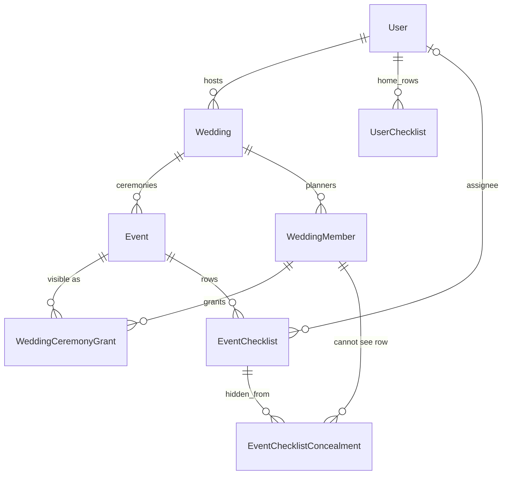

# Wedding container, ceremony visibility, and checklist delegation

| Field | Value |
|---|---|
| Author | Product + engineering (locked grill, 2026-08-15) |
| Date | 2026-08-15 |
| Status | **Superseded** — Event is the parent. Optional sub-events live on `Event.parentId`. No Weddings nav. See implementation 2026-08-15. |
| Reviewers | Host-product owner |
| Apps | `apps/api` (Nest + Prisma), `apps/web` (Next.js App Router) |
| HTTP | Browser calls `proxyClient` → `/api/proxy/*` → Nest. No `fetch()` in `apps/web`. No new dedicated proxy route files. |

---

## 1. Context

Hosts in this product plan Nigerian / diaspora weddings that are **several ceremonies**, not one day: introduction, bride price, a named cultural rite, traditional, court, white, reception. Today each ceremony is a standalone `Event`. There is no parent, no shared money pot, no journey, and no way to hide a ceremony (or a tab, or a checklist row) from a planner who is otherwise in the family.

Event sharing already exists: `EventMember` + `EventMemberRole` + `EventSurface[]`. That is tab-level access on **one** event. It is not a wedding-level person, not a surprise hide, and not “this checklist is yours.”

Home checklists are a **single row** (`UserChecklist`: title, due date, optional event link). Nested “tasks inside a checklist” were tried and rejected. This spec does not bring them back.

This feature adds:

1. A **Wedding** container (the overall thing the couple is planning).
2. **Ceremonies** under it (today’s `Event`), each with a name the host types, an optional preset type, its own budget envelope, and its own planning surfaces.
3. A **journey** — visual order of ceremonies.
4. **Who sees what**: pick ceremonies and tabs on the invite; hide a checklist row as an exception.
5. **Delegation**: assign a checklist row; the assignee sees “Assigned to me” on that ceremony and on Home.

Vendors are out of scope. Hosts and invited planners only.

---

## 2. Functional Requirements

### Wedding and ceremonies

- **FR-1.** A host MUST be able to create a Wedding with a title, currency, and total budget (the **pot**).
- **FR-2.** A host MUST be able to add a ceremony under a Wedding. The ceremony MUST have a **title the host sets**. The host MAY pick a preset type that only pre-fills the title; they MUST be able to rename it. The host MAY add a ceremony that is not in the preset list (`CUSTOM`).
- **FR-3.** Preset types MUST include at least: Introduction, Bride price, Traditional wedding, Court, White wedding, Reception, Engagement. The system MUST add `BRIDE_PRICE`, `COURT`, and `CUSTOM` to `EventType`. Existing types MUST keep working.
- **FR-4.** Ceremonies under one Wedding are **siblings**. A ceremony MUST NOT be the parent of another ceremony.
- **FR-5.** Each ceremony MUST keep its own: date, location, guests, vendors/inquiries, schedule, mood board, checklist, and budget **line items**.
- **FR-6.** An `Event` with `weddingId = null` MUST keep today’s standalone behaviour (create, share, plan). Attaching it to a Wedding MUST be an explicit host action.
- **FR-7.** A host MUST be able to attach an existing standalone event they own to a Wedding they own. The event MUST NOT already belong to another Wedding.
- **FR-8.** Soft-delete rules that apply to `Event` today MUST apply to ceremonies. Deleting a Wedding MUST soft-delete or detach per **EC-8**; it MUST NOT hard-delete planner history without the same `deletedAt` pattern used for events.

### Budget

- **FR-9.** `Event.totalBudget` on a ceremony that belongs to a Wedding is the **envelope**. The sum of envelopes for non-deleted ceremonies in that Wedding MUST be less than or equal to `Wedding.totalBudget` (the pot).
- **FR-10.** Creating or updating a ceremony envelope that would make the sum exceed the pot MUST fail with `400` and MUST NOT persist.
- **FR-11.** Lowering the pot below the current sum of envelopes MUST fail with `400`.
- **FR-12.** Ceremony spend (sum of `EventBudgetItem.spentAmount`) is tracked on the ceremony as today. The Wedding MUST expose a rollup: pot, sum of envelopes, sum of spent — **only for ceremonies and budget surfaces the viewer is allowed to see** (see FR-20).
- **FR-13.** A member who cannot see a ceremony, or cannot see that ceremony’s Budget tab, MUST NOT see that ceremony’s envelope amount, spent amount, or line items on any Wedding rollup or ceremony payload.

### Journey

- **FR-14.** A Wedding MUST expose ceremonies in journey order: `estimatedDate` ascending (nulls last), then `sortOrder` ascending, then `createdAt`.
- **FR-15.** A host MUST be able to reorder ceremonies when dates are missing or they want a manual order. Reorder MUST persist `sortOrder`.
- **FR-16.** The Wedding UI MUST show a journey (progression) of ceremonies the **current viewer** can see. Hidden ceremonies MUST be omitted — no placeholder that reveals a missing step.
- **FR-17.** Completing a ceremony (`Event.isCompleted`) MUST be reflected on the journey (e.g. done vs upcoming). This is display state, not a new workflow engine.

### Invite and visibility

- **FR-18.** A host MUST invite a planner on the **Wedding**. The invite MUST include: email, one role (`EDITOR` | `COMMENTER` | `VIEWER`), and **at least one grant**. Each grant is `{ eventId, surfaces[] }` with at least one surface. Surfaces are the existing `EventSurface` values.
- **FR-19.** Until the host adds a grant, a member MUST NOT see that ceremony (fail closed). Accepting the invite MUST NOT grant extra ceremonies or tabs.
- **FR-20.** Visibility is three layers, all enforced on the API (not only the UI):
  1. **Ceremony** — no grant → treat as not found (`404`), do not confirm it exists.
  2. **Tab** — grant without that surface → `403` on that surface’s endpoints (same as today’s `EventMember` surface gate).
  3. **Row** — a checklist row MAY be hidden from specific Wedding members who otherwise have Checklist on that ceremony. Hidden rows MUST be omitted from their checklist payloads and Home.
- **FR-21.** The Wedding host (`Wedding.userId`) MUST see every ceremony, tab, budget figure, and checklist row.
- **FR-22.** The host MUST be able to update a member’s role and grants after invite (add/remove ceremonies, change tabs). Removing all grants MUST be rejected (`400`); the host MUST remove the member instead.
- **FR-23.** When an event belongs to a Wedding, `POST /events/:id/members` MUST be rejected (`400`) with a message to invite via the Wedding. `GET /events/:id/members` MUST still list people who have a grant on that ceremony.
- **FR-24.** Standalone events (`weddingId = null`) MUST keep `POST /events/:id/members` as today.
- **FR-25.** Attaching a standalone event that already has `EventMember` rows MUST create or reuse a `WeddingMember` per distinct email and add a grant for that ceremony with the existing role and surfaces.

### Checklist delegation

- **FR-26.** A checklist is **one row**. The system MUST NOT add a nested task entity.
- **FR-27.** A host or ceremony Checklist editor MUST be able to assign a ceremony checklist row to **one** user who already has Checklist on that ceremony (or is the host). Assigning to anyone else MUST fail (`400`).
- **FR-28.** A row hidden from a member MUST NOT be assignable to that member.
- **FR-29.** `GET /events/:id/checklist` MUST accept `assignedTo=me`. When set, it MUST return only rows assigned to the current user (and still omit rows hidden from them). Hosts and other editors calling without the query MUST see the full list they are allowed to see, including assignee identity.
- **FR-30.** `GET /users/me/checklists` MUST include rows assigned to the current user (ceremony title, due date, completion, wedding/ceremony ids). Host-created `UserChecklist` rows MUST keep working. Assigned rows MUST NOT require a second nested object.
- **FR-31.** Completing or editing an assigned ceremony row MUST stay the source of truth on `EventChecklist`. If a linked `UserChecklist` exists (today’s host Home link), it MUST stay in sync as it does today.
- **FR-32.** Unassigning MUST remove the row from the assignee’s Home / “Assigned to me” and MUST NOT delete the ceremony row.

---

## 3. Non-Functional Requirements

- **NFR-1.** All authenticated browser HTTP in `apps/web` MUST use `proxyClient` (or the existing RSC/server helpers). The app MUST NOT call `fetch()` for JSON and MUST NOT add `apps/web/src/app/api/proxy/<resource>/route.ts`.
- **NFR-2.** Ceremony existence for a non-grantee MUST be indistinguishable from a missing id: `GET /events/:id` and nested ceremony routes MUST return **404** (not 403) when the user has no ceremony grant and is not the host. Time to first byte of that 404 MUST match other not-found paths (no extra “exists but hidden” delay beyond one membership lookup).
- **NFR-3.** List endpoints for a Wedding (`GET /weddings/:id`, journey, rollup) MUST complete in one request that already applies visibility filters in the query layer — not “load all then strip in the client.”
- **NFR-4.** Clerk remains the identity provider. Invite accept MUST bind the signed-in user’s email to the invite email (same rule as today’s event invite).
- **NFR-5.** Money fields stay integer minor units (cents) consistent with `Event.totalBudget` / budget items today. Currency on ceremonies in a Wedding MUST equal `Wedding.currency`.
- **NFR-6.** New tables MUST use `cuid` ids, `created_at` / `updated_at`, and snake_case `@@map` names consistent with `schema.prisma`.
- **NFR-7.** Existing event, checklist, budget, guest, and standalone-member tests MUST keep passing for `weddingId = null` events.

---

## 4. Acceptance Criteria

- **AC-1.** (FR-1, FR-2, FR-3) Given a signed-in host, when they create a Wedding and add a ceremony with preset `BRIDE_PRICE` then rename the title to “Family bride price,” then the ceremony is stored under that Wedding with `eventType = BRIDE_PRICE` and `title = "Family bride price"`.
- **AC-2.** (FR-2, FR-3) Given a Wedding, when the host adds a ceremony with `eventType = CUSTOM` and title “Nkuho,” then it appears on the journey with that title.
- **AC-3.** (FR-4, FR-14, FR-16) Given ceremonies Introduction, Traditional, White on one Wedding, when a member has grants only for Introduction and White, then their journey contains exactly those two, in date/sort order, with no gap marker for Traditional.
- **AC-4.** (FR-9, FR-10) Given pot `100000` and envelopes `40000 + 40000`, when the host sets a third envelope to `30000`, then the API returns `400` and envelopes are unchanged.
- **AC-5.** (FR-11) Given envelopes summing to `80000`, when the host PATCHes the pot to `70000`, then the API returns `400`.
- **AC-6.** (FR-12, FR-13, FR-20) Given a hidden ceremony with envelope `20000` and spent `5000`, when a member without that grant loads the Wedding rollup, then pot is visible, and neither `20000` nor `5000` appear in envelope or spent totals.
- **AC-7.** (FR-15) Given three ceremonies, when the host POSTs a new order of ids, then `GET` the Wedding returns that order when dates are equal or null.
- **AC-8.** (FR-18, FR-19) Given an invite with one grant `{ eventId: traditional, surfaces: [CHECKLIST] }`, when the member accepts and GETs the White ceremony id, then the API returns `404`.
- **AC-9.** (FR-20) Given that member GETs Traditional checklist, then they receive rows. When they GET Traditional budget, then the API returns `403`.
- **AC-10.** (FR-20, FR-28) Given a checklist row hidden from member M, when M GETs the ceremony checklist or Home checklists, then that row is absent. When the host assigns that row to M, then the API returns `400`.
- **AC-11.** (FR-23, FR-24) Given event A in a Wedding and event B standalone, when the host POSTs `/events/A/members`, then `400`. When they POST `/events/B/members` with a valid body, then the invite is created as today.
- **AC-12.** (FR-25) Given a standalone event with an accepted member, when the host attaches the event to a Wedding, then that email is a Wedding member with a grant matching the old role and surfaces.
- **AC-13.** (FR-27, FR-29, FR-30) Given member M has Checklist on Traditional, when the host assigns “Book aso-ebi” to M, then M’s `GET /events/traditional/checklist?assignedTo=me` and `GET /users/me/checklists` both include that row with due date and ceremony title, and another member N does not see it in `assignedTo=me`.
- **AC-14.** (FR-32) Given that assignment, when the host unassigns, then the row remains on the ceremony list for editors and is gone from M’s assigned and Home lists.
- **AC-15.** (FR-22) Given a member with two ceremony grants, when the host PATCHes grants to `[]`, then `400` and grants are unchanged.
- **AC-16.** (FR-6, NFR-7) Given an event with `weddingId = null`, when the host uses today’s event create/list/share/checklist APIs, then behaviour matches the pre-feature contract.
- **AC-17.** (FR-21) Given any hide or grant configuration, when the host GETs the Wedding and each ceremony, then they see all ceremonies, all tabs, all rows, and the full pot rollup.
- **AC-18.** (NFR-1) Given the web app, when a client component loads Weddings or assigns a checklist, then the call goes through `proxyClient` and no new `app/api/proxy/<name>/route.ts` file exists.

---

## 5. Edge Cases

- **EC-1.** Invite email does not match the signed-in Clerk email on accept → reject as today (`400`), do not bind the wrong user.
- **EC-2.** Invite to an email that is already a Wedding member → `400` “already invited”; host MUST PATCH grants, not create a second member.
- **EC-3.** Grant references an `eventId` not in this Wedding or soft-deleted → `400`.
- **EC-4.** Assignee user id is valid but has no Checklist grant on that ceremony → `400`.
- **EC-5.** Host assigns a row to themselves → allowed.
- **EC-6.** Member loses Checklist surface after they were assigned rows → they MUST lose “Assigned to me” and Home copies; rows stay on the ceremony; assignee field MAY remain until the host clears it (API MUST still omit the row from that member).
- **EC-7.** Two hosts / transferring Wedding ownership → not supported. `Wedding.userId` is the only host.
- **EC-8.** Delete Wedding: MUST set `Wedding.deletedAt`. Ceremonies MUST set `deletedAt` (same as event delete). Members and grants become inaccessible. Standalone attach is not undone after delete (ceremonies stay deleted with the wedding).
- **EC-9.** Detach ceremony from Wedding (host action): MUST set `event.weddingId = null`, keep envelope as `totalBudget`, remove grants for that event. The event becomes standalone; existing `EventMember` rows MUST be ensured so standalone sharing still works.
- **EC-10.** Neon / Prisma transient connection errors on write → existing Prisma pool retry behaviour; the client MUST receive a `5xx`, not a partial grant (invite + grants in one transaction).
- **EC-11.** Concurrent envelope updates that together exceed the pot → the second transaction MUST fail `400` (read sum in the same transaction as the update).
- **EC-12.** `assignedTo=me` for a user who is not a member and not host → `404` on the ceremony (FR-20 layer 1).

---

## 6. API Contracts

Base path: Nest `/api/*` as today. Web: `proxyClient.get/post/patch/delete('/weddings/...')`.

### 6.1 Types

```ts
type EventType =
  | 'INTRODUCTION'
  | 'BRIDE_PRICE'
  | 'TRADITIONAL_WEDDING'
  | 'COURT'
  | 'WHITE_WEDDING'
  | 'RECEPTION'
  | 'ENGAGEMENT'
  | 'NAMING_CEREMONY'
  | 'CUSTOM'

type EventSurface = 'SCHEDULE' | 'CHECKLIST' | 'BUDGET' | 'MOODBOARD' | 'VENDORS' | 'GUESTS'
type EventMemberRole = 'EDITOR' | 'COMMENTER' | 'VIEWER'

interface CeremonyGrant {
  eventId: string
  surfaces: EventSurface[]
}

interface WeddingJourneyStop {
  id: string
  title: string
  eventType: EventType
  estimatedDate: string | null
  sortOrder: number
  isCompleted: boolean
  allocatedBudget: number // omitted / 0-safe: only if viewer can see Budget on this stop
  spentAmount?: number    // only if viewer can see Budget
}

interface WeddingBudgetRollup {
  currency: string
  pot: number
  envelopesTotal: number // visible ceremonies with Budget only
  spentTotal: number
}

interface Wedding {
  id: string
  title: string
  currency: string
  totalBudget: number
  createdAt: string
  updatedAt: string
  viewer: { isHost: boolean; role: 'HOST' | EventMemberRole }
  journey: WeddingJourneyStop[]
  budget: WeddingBudgetRollup
}

interface WeddingMember {
  id: string
  email: string
  role: EventMemberRole
  grants: CeremonyGrant[]
  acceptedAt: string | null
  createdAt: string
  inviteUrl?: string
  user: { id: string; firstName: string | null; lastName: string | null; email: string } | null
}

interface AssignedChecklist {
  id: string // EventChecklist id
  title: string
  isCompleted: boolean
  dueDate: string | null
  eventId: string
  eventTitle: string
  weddingId: string | null
  assigneeUserId: string
  source: 'ASSIGNED' // distinguishes from UserChecklist on Home
}
```

`GET /users/me/checklists` response becomes a discriminated list:

```ts
type HomeChecklist =
  | (UserChecklist & { source: 'MINE' })
  | (AssignedChecklist & { source: 'ASSIGNED' })
```

Existing `UserChecklist` fields MUST remain for `source: 'MINE'`.

### 6.2 Endpoints

| Method | Path | Auth | Success | Errors |
|---|---|---|---|---|
| POST | `/weddings` | host user | `201 Wedding` | `400` validation |
| GET | `/weddings` | user | `200 Wedding[]` (host or member; visibility applied) | |
| GET | `/weddings/:id` | host or member | `200 Wedding` | `404` |
| PATCH | `/weddings/:id` | host | `200 Wedding` | `400` pot vs envelopes (FR-11), `404` |
| DELETE | `/weddings/:id` | host | `200 { ok: true }` | `404` |
| POST | `/weddings/:id/ceremonies` | host | `201 Event` (existing event shape + `weddingId`) | `400` envelope (FR-10) |
| POST | `/weddings/:id/ceremonies/attach` | host | `200 Event` | `400` not owner / already attached / other wedding |
| POST | `/weddings/:id/ceremonies/reorder` | host | `200 Wedding` | `400` id set mismatch |
| POST | `/weddings/:id/ceremonies/:eventId/detach` | host | `200 Event` | `404` |
| GET | `/weddings/:id/members` | host | `200 { host, members }` | `403` non-host, `404` |
| POST | `/weddings/:id/members` | host | `201 WeddingMember` | `400` EC-2, EC-3, empty grants |
| PATCH | `/weddings/:id/members/:memberId` | host | `200 WeddingMember` | `400` FR-22, `404` |
| DELETE | `/weddings/:id/members/:memberId` | host | `200 { ok: true }` | `404` |
| GET | `/weddings/join/:token` | public | invite preview (title, host name, grant labels) | `404` |
| POST | `/weddings/invites/:token/accept` | signed-in | `{ weddingId }` | `400` EC-1, `404` |

Ceremony planning APIs stay on `/events/:id/...`. Access service MUST use Wedding grants when `event.weddingId` is set.

| Method | Path | Notes |
|---|---|---|
| GET | `/events/:id/checklist?assignedTo=me` | FR-29 |
| PATCH | `/events/:id/checklist/:itemId` | body MAY include `assigneeUserId: string \| null` and `hiddenFromMemberIds: string[]` |
| POST | `/events/:id/members` | `400` if `weddingId` set (FR-23) |

### 6.3 Request bodies

```ts
// POST /weddings
{ title: string; totalBudget: number; currency?: string }

// PATCH /weddings/:id
{ title?: string; totalBudget?: number; currency?: string }

// POST /weddings/:id/ceremonies
{
  title: string
  eventType: EventType
  estimatedDate?: string | null
  location?: string | null
  allocatedBudget?: number // default 0
  tribes?: string[]
  theme?: WeddingTheme
}

// POST .../attach
{ eventId: string }

// POST .../reorder
{ eventIds: string[] } // complete set of non-deleted ceremony ids

// POST /weddings/:id/members
{
  email: string
  role: EventMemberRole
  grants: CeremonyGrant[] // min 1; each surfaces min 1
}

// PATCH member
{ role?: EventMemberRole; grants?: CeremonyGrant[] }

// PATCH checklist item (additions)
{ assigneeUserId?: string | null; hiddenFromMemberIds?: string[] }
```

---

## 7. Data Models

### 7.1 New: `Wedding`

| Field | Type | Constraints |
|---|---|---|
| id | String (cuid) | PK |
| userId | String | FK User, host, onDelete Cascade |
| title | String | required |
| totalBudget | Int | pot, `>= 0` |
| currency | String | default `CAD` |
| createdAt | DateTime | |
| updatedAt | DateTime | |
| deletedAt | DateTime? | soft delete |

Indexes: `[userId]`, `[deletedAt]`. Map: `weddings`.

### 7.2 New: `WeddingMember`

| Field | Type | Constraints |
|---|---|---|
| id | String (cuid) | PK |
| weddingId | String | FK Wedding Cascade |
| userId | String? | FK User SetNull |
| email | String | |
| role | EventMemberRole | one role for all grants |
| token | String | unique |
| invitedById | String | FK User Restrict |
| acceptedAt | DateTime? | |
| createdAt / updatedAt | DateTime | |

Unique: `[weddingId, email]`. Indexes: `[weddingId]`, `[userId]`. Map: `wedding_members`.

### 7.3 New: `WeddingCeremonyGrant`

| Field | Type | Constraints |
|---|---|---|
| id | String (cuid) | PK |
| weddingMemberId | String | FK WeddingMember Cascade |
| eventId | String | FK Event Cascade |
| surfaces | EventSurface[] | min 1 in application |

Unique: `[weddingMemberId, eventId]`. Map: `wedding_ceremony_grants`.

### 7.4 Change: `Event`

| Field | Type | Constraints |
|---|---|---|
| weddingId | String? | FK Wedding SetNull |
| sortOrder | Int | default 0 |

`totalBudget` = envelope when `weddingId` is set. `currency` MUST match Wedding when attached. `title` remains the display name.

### 7.5 Change: `EventType` enum

Add: `BRIDE_PRICE`, `COURT`, `CUSTOM`. Do not remove existing values.

### 7.6 Change: `EventChecklist`

| Field | Type | Constraints |
|---|---|---|
| assigneeUserId | String? | FK User SetNull |

Index: `[assigneeUserId, isCompleted]`.

### 7.7 New: `EventChecklistConcealment`

| Field | Type | Constraints |
|---|---|---|
| id | String (cuid) | PK |
| checklistId | String | FK EventChecklist Cascade |
| weddingMemberId | String | FK WeddingMember Cascade |

Unique: `[checklistId, weddingMemberId]`. Map: `event_checklist_concealments`.

### 7.8 Unchanged (must not grow a task child)

- `UserChecklist` — still one row; optional `eventId` / `eventChecklistId` for host Home link.
- `EventMember` — remains for **standalone** events. For wedding-linked events, access is `WeddingMember` + `WeddingCeremonyGrant`. Attach (FR-25) and detach (EC-9) MUST keep these consistent.
- `EventBudgetItem`, guests, schedule, mood board — stay on `Event`.

### 7.9 Relationships (ERD)



---

## 8. Out of Scope

| ID | Exclusion | Reason |
|---|---|---|
| OS-1 | Vendor accounts, vendor onboarding, vendor seeing planner checklists | Host-first; vendor later |
| OS-2 | Jira statuses, sprints, epics, kanban columns | Assignment + “Assigned to me” only; done = checkbox |
| OS-3 | Nested tasks under a checklist | Explicitly rejected earlier |
| OS-4 | Hiding a single budget line, schedule item, or guest | Row hide is checklist-only this pass |
| OS-5 | Guest/RSVP visibility (surprise party for attendees) | Planner ACL only |
| OS-6 | Wedding-level guest list or shared contacts | Guests stay per ceremony |
| OS-7 | Multiple hosts or role `HOST` on members | Single `Wedding.userId` |
| OS-8 | Auto-seed default ceremonies or default checklists | Host creates what they need |
| OS-9 | Backfilling a Wedding for every existing Event | Opt-in attach (FR-7) |
| OS-10 | New Next.js proxy route files | Catch-all `/api/proxy/[...path]` only |
| OS-11 | Per-ceremony role (editor on Traditional, viewer on White) | One role on `WeddingMember`; tabs differ per grant |
| OS-12 | Naming-ceremony as a second container type | Can be standalone or `CUSTOM` / existing type under a Wedding if the host wants |

---

## 9. Implementation notes (non-normative)

- Reuse `event-access.service.ts`: if `event.weddingId`, resolve `WeddingMember` + grant; else `EventMember`. Host if `wedding.userId === user.id` or `event.userId === user.id` for standalone.
- Invite + grants MUST be one DB transaction (EC-10).
- Envelope vs pot MUST be checked in the same transaction as the write (EC-11).
- Journey UI lives on the Wedding page; ceremony pages stay the existing event tabs, filtered by grant.
- Preset picker is UI-only; the API stores `eventType` + `title`.

---

## 10. Approval

Reply **Approved** (or request edits). Implementation starts only after Status is set to Approved.
